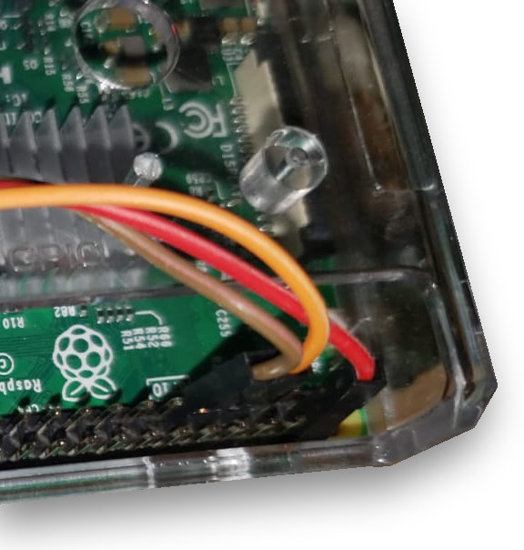
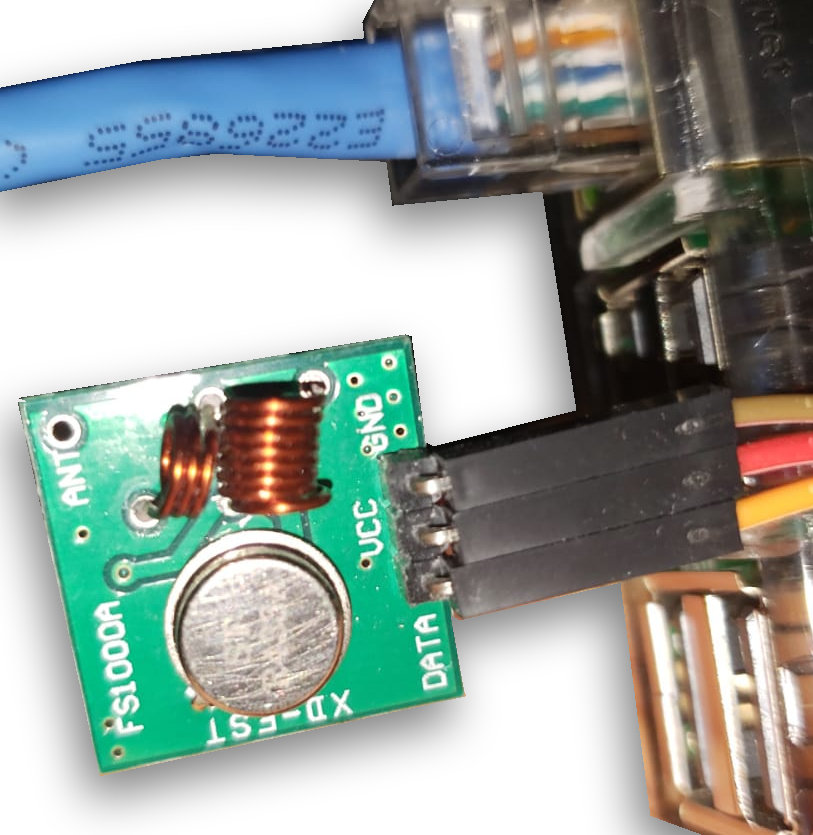

# Pi-Somfy

## 1 Overview

This project allows to operate multiple Somfy Shutter with a Raspberry Pi with cheap hardware costing less than $2. It comes with a command line interface, a web interface and an Amazon Alexa interface. 

## 2 Hardware

This project has been developed and tested with a Raspberry Pi 3 as the base platform. Since the serial port and network are the only external ports used, the program could be used on other platforms with minor modifications and testing.

In development and testing I used the Raspberry Pi3 both with Wi-Fi connectivity and Ethernet cable. Note that the hardware has to be reasonably close to the shutters you operate, as the signal strength will otherwise not be sufficient.

As of now, you have to build your own hardware. Here are the steps to do so.
1. You need the RF Transmitter. If you wish to order it from eBay, this link maybe helpful:  [Order](https://www.ebay.com/sch/sis.html?_nkw=5x+433Mhz+RF+transmitter+and+receiver+kit+Module+Arduino+ARM+WL+MCU+Raspberry). Note that I bricked my first Transmitter when soldering, so ordering more than one may be a good idea.
1. You need an oscillator for a 433.42 MHz frequency. The above RF transmitter comes with a common 433.93 MHz one, which will not work with your Somfy shutter. If you wish to order it from eBay, this link maybe helpful:  [Order](https://www.ebay.com/sch/sis.html?_nkw=433.42M+R433+F433+SAW+Resonator+Crystals+TO-39)
1. You will need cables to connect the transmitter to the Raspberry Pi. Any cable will do obviously, but I found these quite helpful.  [Order](https://www.ebay.com/itm/40Pin-Multicolored-Dupont-Wire-Kits-Breadboard-Female-Jumper-Ribbon-Cable/113310899442)

Once you have all the hardware handy, now it's time to exchange the oscillator, which requires a bit of soldering. Reason for this is that the emitter you bought uses a common 433.93 MHz frequency, Somfy however requires a 433.__42__ MHz frequency. Take the following 3 easy steps to exchange the oscillator
1. Identify the oscillator. It looks like this (marked with a red circle):  .  Turn the RF Transmitter around. You will see that the oscillator is soldered in on 3 points  . 
1. While pulling the oscillator from the front, heat up the 3 soldering point on the back with the soldering iron until the oscillator is detached from the board. 
1. Not put in the new oscillator (make sure all 3 pins connect through the print) and solder it in again.

And you are done! As mentioned above, I got step 3 wrong the first time round. One of the pins was not properly connected and I was lucky I ordered spare emitters and oscillators

Now the last step is to connect you adjusted RF transmitter to your Raspberry Pi. Use the following diagram to help you connect it

Note that I used GPIO 4 but you can change the value of __TXGPIO__ to whatever you want if you choose a different way to connect your RF emitter. This is a configuration parameter in operateShutters.conf.

OK. now this all should look like this. Note that some of the pictures are a bit confusing with regards to which GPIO a cable connects to. The above diagram easier to see. But if you struggle, maybe the [Wiring Diagram](documentation/Wiring Diagram.txt) helps.

 
 
 

## 3 Software

## 4 Credits
This Library was ported from [Arduino sketch](https://github.com/Nickduino/Somfy_Remote) onto the Pi by @Nickduino to open and close my blinds automatically. 

If you want to learn more about the Somfy RTS protocol, check out [Pushtack](https://pushstack.wordpress.com/somfy-rts-protocol/). It's because of this blog that I was able to write all my code.

Then, connect it to your Raspberry Pi (I used GPIO 4 but you can change the value of __TXGPIO__ to whatever you want).

The script will use the __ephem library__ and __pigpiod daemon__ to open and close Somfy (or SIMU) blinds, depending on the time of sunrise/sunset (or whatever you feel like: open your blinds the first monday of the month if you want).
The remote address (which you'll create and will be recognised by your blinds as a new remote) and rolling code (incremented every time you send a frame) are stored in a specific file for each remote (one per blind, one per room, one per level, ...).
